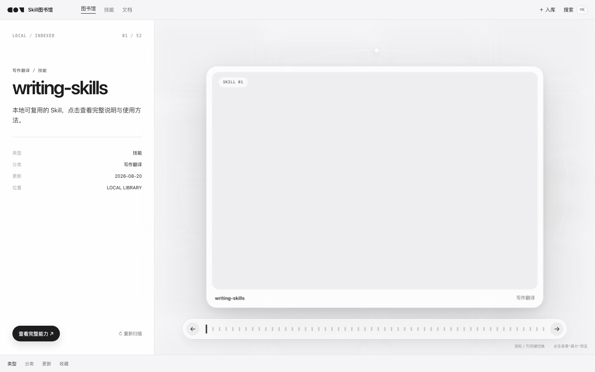
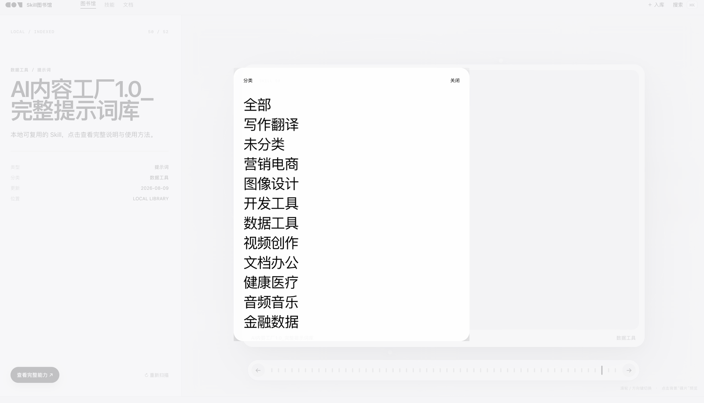
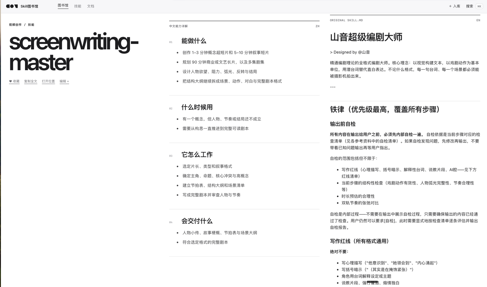

# Skill 图书馆（Skill Library）

一个本地运行、零依赖的 Markdown + 技能管理工具，包含三个部分：

- **网页界面**：Orbit 轨道浏览 / Stack 堆叠切换 / ⌘K 全局搜索，数据来自本机 `library.db`
- **命令行工具**：`lib.py`，负责扫描、入库、检索
- **多 agent 支持**：自动扫描 Codex / Claude Code 的技能、Cursor / Trae 的规则，统一管理
- **Codex 联动技能**：`library-manager`，让 Codex 在安装新技能、写新 md 时主动帮你入库、生成封面

技能入库时会根据名称与描述自动分类（如 金融数据 / 图像设计 / 视频创作 / 开发工具 / 文档办公 等）。

## 界面预览








---

## 一、环境要求

- macOS / Windows（Linux 大部分功能也可用）
- Python 3（建议 3.8 及以上）
- 可选：Codex / Claude Code / Cursor / Trae（工具会自动扫描这些 agent 的技能与规则目录；一个都没有也可以手动 `add` md 文件）

检查 Python：

macOS / Linux：

```bash
python3 --version
```

Windows：

```bat
python --version
```

（如果提示不是命令，改成 `py --version` 再试）

看到 `Python 3.x.x` 即为正常。

---

## 二、快速开始

### macOS

第 1 步：解压后把整个文件夹放到：

```text
~/Documents/Skill图书馆
```

> 建议用这个固定路径。因为「library-manager 联动技能」内部写的是这个路径，换到别处需要同步改它里面的命令。

第 2 步：给启动器加执行权限

打开「终端」，粘贴：

```bash
chmod +x ~/Documents/Skill图书馆/start.command
```

第 3 步：启动

双击 `start.command`，或：

```bash
cd ~/Documents/Skill图书馆
python3 lib.py open
```

### Windows

第 1 步：解压到任意目录（建议 `C:\Users\你的用户名\Documents\Skill图书馆`）

第 2 步：双击 `start.bat`，或在命令行：

```bat
cd /d C:\Users\你的用户名\Documents\Skill图书馆
python lib.py open
```

（如果 `python` 不是命令，把上面两处 `python` 换成 `py`）

> 成功标志：浏览器自动打开 `http://127.0.0.1:8765`，看到图书馆界面。

---

## 三、常用命令

| 命令 | 作用 |
| --- | --- |
| `python3 lib.py open` | 启动网页并自动打开浏览器 |
| `python3 lib.py serve` | 只启动网页，不自动开浏览器 |
| `python3 lib.py scan` | 扫描 Codex / Claude 技能、Cursor / Trae 规则并入库 |
| `python3 lib.py scan --system` | 同时收录内置插件技能 |
| `python3 lib.py add <路径>` | 把文件 / 技能目录加入图书馆（交互式询问类型与分类） |
| `python3 lib.py add <路径> -t skill -c 图像设计` | 指定类型和分类，免交互 |
| `python3 lib.py list` | 命令行查看馆藏 |
| `python3 lib.py list -q <关键词>` | 按关键词搜索 |
| `python3 lib.py list --fav` | 只看收藏 |

---

## 四、第一次使用：把技能扫进来

```bash
cd ~/Documents/Skill图书馆
python3 lib.py scan
```

它会自动扫描这些目录并入库：

- Codex：`~/.codex/skills/*/SKILL.md`
- Claude Code：`~/.claude/skills/*/SKILL.md`
- Cursor：`~/.cursor/rules/*.mdc`
- Trae：`~/.trae/rules/*.md`、`~/.trae-cn/rules/*.md`

> 成功标志：终端打印 `扫描完成，共登记 N 条`，网页里出现对应卡片，详情页会标注来源（Codex / Claude Code / Cursor / Trae）。

没有 Codex 或没有技能目录也没关系，可以用 `add` 手动加入任意 md 文件：

```bash
python3 lib.py add ~/Desktop/我的笔记.md
```

---

## 五、与 Codex 联动（可选）

想让 Codex 在「安装新技能」或「帮你写新 md」之后**主动问你是否入库**，并**可选地为新技能自动生成封面图**，把仓库里自带的联动技能装上即可：

```bash
cp -R ~/Documents/Skill图书馆/skills/library-manager ~/.codex/skills/
```

> 前提：项目放在 `~/Documents/Skill图书馆`。如果放在别处，打开 `skills/library-manager/SKILL.md`，把里面所有 `~/Documents/Skill图书馆` 改成你的实际路径。

想停止联动，删除即可：

```bash
rm -rf ~/.codex/skills/library-manager
```

---

## 六、关于封面图（重要，请先读这里）

封面图统一放在 `app/static/assets/skills/` 目录，前端按两条规则查找：

1. **约定命名**：封面文件名 = 条目名 + `.jpg`。例如技能 `frontend-design` 对应 `frontend-design.jpg`。英文名技能把图放进去即可自动显示，无需改代码。
2. **显式映射**：中文名或特殊文件名，在 `app/static/skill-guides-zh.js` 里登记 `cover` 字段（下面有示例）。

找不到封面时，界面会优雅显示为灰色底，不会出现破图。

### 方式 A：让 Codex 自动生成（推荐）

装上「五、与 Codex 联动」里的 `library-manager` 技能后，每当你让 Codex 入库一个新技能，它会主动问：

> 要我为这个技能生成一张封面图吗？

回复「生成」，Codex 会调用生图工具做一张 3:2 封面，自动放进封面目录并处理好命名 / 映射，刷新网页即可看到。

### 方式 B：手动加封面

1. 准备一张 JPG 封面图（建议 3:2），放进 `app/static/assets/skills/`。
2. 英文名：命名成 `<条目名>.jpg`，完事。
3. 中文名：用英文别名命名（如 `my-skill.jpg`），再打开 `app/static/skill-guides-zh.js`，在 `window.SKILL_GUIDES_ZH = { ... }` 里登记：

   ```js
   "<条目名>": {
     cover: "my-skill.jpg",
     tagline: "一句话介绍",
     canDo: ["能力一", "能力二"],
     when: ["适用场景"],
     workflow: ["步骤一", "步骤二"],
     output: ["产出"]
   },
   ```

4. 刷新网页即可显示。

---

## 七、桌面快捷方式

项目不自带桌面图标，但提供了一键生成脚本。

### macOS

双击项目里的 `install-desktop-icon.command`，它会自动在桌面生成「Skill图书馆」图标。

> 成功标志：终端显示「✅ 完成！桌面已出现…」，桌面出现图标；双击后浏览器打开图书馆，再双击不会开多个窗口。
>
> 若首次双击提示「无法打开」，右键点它 →「打开」即可（macOS 对未签名脚本的正常提示）。

### Windows

双击项目里的 `install-desktop-icon.bat`，它会自动在桌面生成「Skill Library」快捷方式。

> 成功标志：弹出窗口显示 `Done. A shortcut named "Skill Library" is now on your Desktop.`，桌面出现图标。

也可以不建图标，直接用启动器：macOS 双击 `start.command`，Windows 双击 `start.bat`。

---

## 八、目录结构

```text
Skill图书馆/
├── lib.py                       # 主程序（本地服务 + 命令行）
├── start.command                # macOS 双击启动器
├── install-desktop-icon.command # macOS 一键创建桌面图标
├── start.bat                    # Windows 双击启动器
├── install-desktop-icon.bat     # Windows 一键创建桌面快捷方式
├── library.db                   # 本地索引数据库（首次运行自动生成）
├── prompts/                     # 集中存放的提示词
├── manuals/                     # 集中存放的手册
├── skills/library-manager/      # Codex 联动技能（可选安装）
├── docs/screenshots/            # 界面截图
├── app/static/                  # 网页界面
│   ├── index.html
│   ├── app.js
│   ├── style.css
│   ├── skill-guides-zh.js
│   └── assets/skills/           # 封面图
├── .gitignore
└── LICENSE
```

---

## 九、工作原理

- **技能 / 规则**：每次启动或运行 `scan` 时，自动扫描 Codex、Claude Code 的技能目录（`SKILL.md`）以及 Cursor、Trae 的规则目录（`.md` / `.mdc`），解析 frontmatter 后统一登记，来源会记录在每条目的「来源」字段里
- **自动分类**：内置一套通用领域关键词规则，会根据技能的名称和描述自动归到「金融数据 / 图像设计 / 视频创作 / 开发工具 / 文档办公 / 数据工具 / 音频音乐 / 写作翻译」等分类。分类名是动态的，识别到新领域就会自动生成新分类，不会写死。识别不出来的会先归「未分类」，你可以手动改，或让 Codex（装了 library-manager）帮你判断
- **提示词 / 手册**：`add` 时复制一份到 `prompts/` 或 `manuals/`，原文件不动
- **服务**：只监听本机 `127.0.0.1`，不联网、不上传任何数据

---

## 十、隐私与数据说明

- 所有数据都保存在本机 `library.db` 里，不会联网上传
- `library.db` 里记录了你的本地文件路径，**不要把它上传到公开仓库**（本仓库的 `.gitignore` 已默认排除）
- `prompts/` 和 `manuals/` 里的内容属于你的私人整理，是否开源请自行判断

---

## 十一、常见问题

**问：浏览器打不开 `127.0.0.1:8765`？**

答：确认终端里服务还在运行；或换一个端口启动：

```bash
LIB_PORT=9000 python3 lib.py open
```

**问：`scan` 后没有技能？**

答：确认下面至少有一个目录存在且有内容：Codex 的 `~/.codex/skills`、Claude Code 的 `~/.claude/skills`（里面是带 `SKILL.md` 的技能目录），或 Cursor / Trae 的规则目录。都没有的话，用 `add` 手动加 md 文件即可。

**问：双击 `start.command` 提示「没有权限」？**

答：回到「第二步」执行 `chmod +x` 加权限。

---

## License

本项目使用 MIT License，详见 [LICENSE](LICENSE)。
